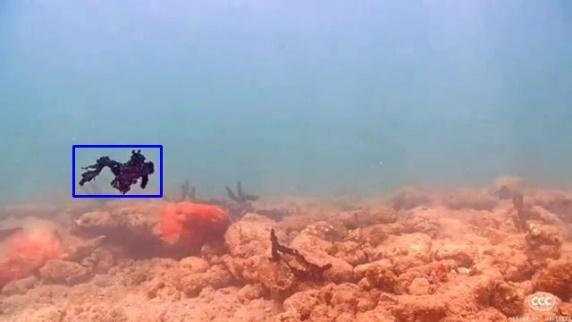
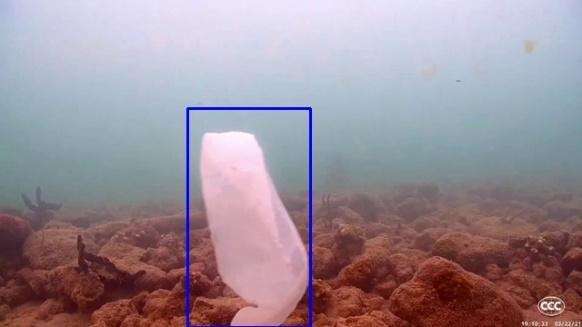
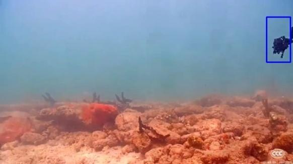
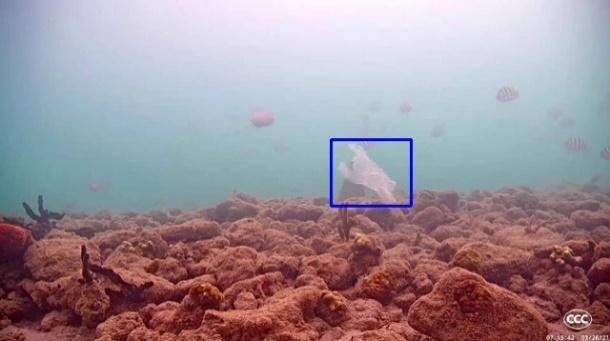

Here is the final `README.md` file for your GitHub repository:

```markdown
# Underwater Trash Detection

This project focuses on detecting underwater trash using a stationary camera. The detection process involves collecting and preparing data, extracting trash from video frames, and recreating the output video with bounding boxes around detected trash objects.

## Table of Contents
- [Abstract](#abstract)
- [Data Collection](#data-collection)
- [Data Preparation](#data-preparation)
- [Trash Detection](#trash-detection)
- [Video Processing](#video-processing)
- [Lessons Learned](#lessons-learned)
- [Setup](#setup)
- [Usage](#usage)
- [Contributing](#contributing)
- [License](#license)

## Abstract
In this challenge, we focused mainly on choosing good datasets, training well, and selecting a well prediction threshold for the trash in the video.

## Data Collection
We used the Trash-ICRA19 dataset, labeling data on fish and trash. The data was collected from various sources and annotated using bounding boxes.

## Data Preparation
The data was pulled using Google Drive API and transferred to a custom vision service. We trained the data and assigned regions to the objects.



## Trash Detection
The detection process involves fetching the video URL, cutting it into frames, and passing frames to a custom vision service to detect trash objects. The service returns bounding boxes around detected trash objects, which are then drawn on the frames.


*Detected trash with bounding box*


*Detected trash with bounding box*

## Video Processing
After processing the frames, they are stacked again to recreate the output video with detected trash objects.



## Lessons Learned
We faced challenges with subscription quotas and had to use multiple accounts to complete the task.

## Setup
1. Clone the repository:
   ```bash
   git clone https://github.com/MatthewNader2/Underwater-Trash-Detection.git
   ```
2. Navigate to the project directory:
   ```bash
   cd Underwater-Trash-Detection
   ```
3. Install the required packages:
   ```bash
   pip install -r requirements.txt
   ```

## Usage
1. Run the data collection script:
   ```bash
   python scripts/data_collection.py
   ```
2. Run the data preparation script:
   ```bash
   python scripts/data_preparation.py
   ```
3. Run the trash detection script:
   ```bash
   python scripts/trash_detection.py
   ```
4. Run the video processing script:
   ```bash
   python scripts/video_processing.py
   ```

## Contributing
Contributions are welcome! Please open an issue or submit a pull request for any changes.

## License
This project is licensed under the MIT License - see the [LICENSE](LICENSE) file for details.
```

This `README.md` file includes an overview of the project, instructions for setup and usage, and images to illustrate the process. Make sure the image paths are correct and the images are uploaded to the appropriate directories in your repository.
